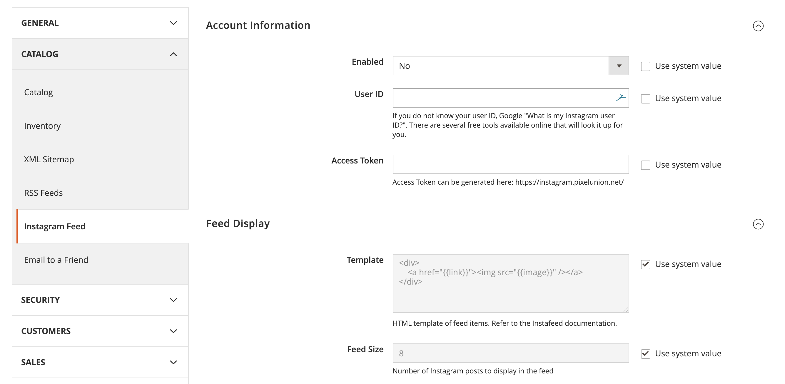

# Magento 2 Extension: Instafeed

Easily add your **Instagram feed** to Magento 2 storefronts, via [instafeed.js](http://instafeedjs.com).


## Table Of Contents
1. [Requirements](#requirements)
1. [Installation](#installation)
1. [Configuration](#configuration)
1. [Changelog](#changelog)
1. [License](#license)
1. [Credits](#credits)
1. [Author](#author)

## Requirements

- PHP >= 7.0
- Magento >= 2.3

## Installation

### Install via Composer (recommended)

Run the following command in Magento 2 root folder:

```
composer require markahesketh/magento2-module-instafeed
php bin/magento setup:upgrade
php bin/magento setup:static-content:deploy
```

### Install via zip (not recommended)

* [Download the latest version from GitHub](https://github.com/markahesketh/module-instafeed/releases)
* Extract module files into `<magento 2 directory>/app/code/MarkHesketh/Instafeed` on your web server
    * Exact instructions for this step can vary wildly based on your Magento store. Please seek technical advice if you are unsure.
    
## Configuration

Open the Magento 2 Admin Panel and navigate to:
 
 **Stores > Settings > Configuration > Catalog > Instagram Feed**



### Available Configuration

#### Enabled

Enable or disable the Instagram feed.

#### User ID (Required)

Instagram User ID of feed to display.

This can be found by Googling ["What is my Instagram User ID?"](https://www.google.com/search?q=what+is+my+instagram+user+id) and using one of the many free website tools.

For example, [Find Instagram User ID](https://codeofaninja.com/tools/find-instagram-user-id) by Mike Dalisay.

#### Access Token (Required)

Instagram API Access token, required by Instagram to display your feed.

You can generated a code using the [Instagram Access Token Generator](https://instagram.pixelunion.net/) by Pixel Union.

Alternatively, access tokens can be created by [registering with Instagram's API Platform](https://www.instagram.com/developer/).

#### Template

**Default: `<div><a href="{{link}}"></a></div>`**

The HTML to use when rendering an Instagram post

Refer to the [Instafeed.js templating documentation](http://instafeedjs.com/#templating) for more information.

#### Feed Size (Default: 8)

The maximum size limit of Instagram images to display.

## Changelog

See [CHANGELOG](CHANGELOG) within this repository.

## License

This extension is open-sourced software licensed under the [OSL 3.0 License](https://opensource.org/licenses/osl-3.0).

## Credits

- [instafeed.js](http://instafeedjs.com): JS library used to generate Instagram feeds
- [fodorelli/M2InstaFeed](https://github.com/fodorelli/M2InstaFeed): The original extension used as reference and inspiration

## Author

[Mark Hesketh](https://markhesketh.co.uk/) ([@markahesketh](https://twitter.com/markahesketh)): PHP Developer from Manchester, UK.